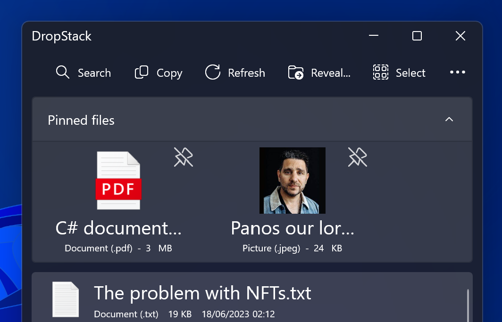
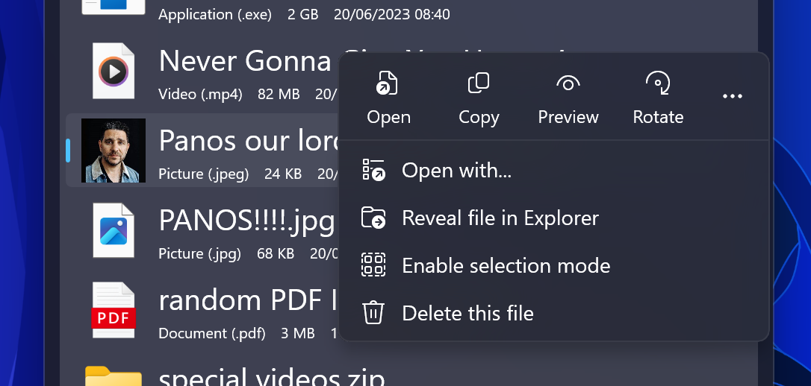
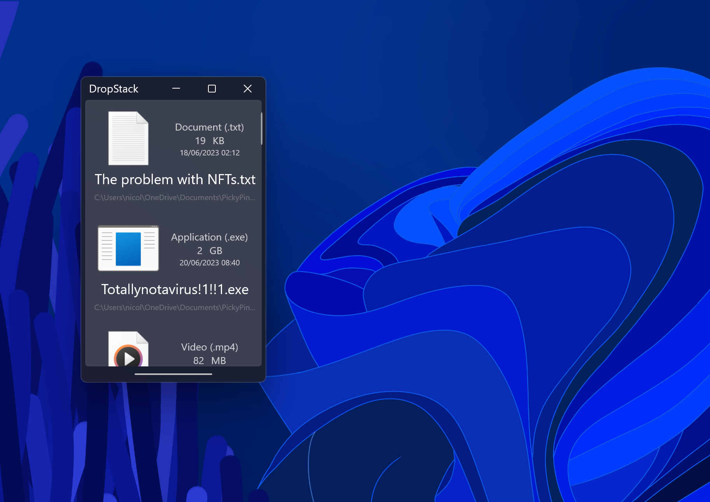
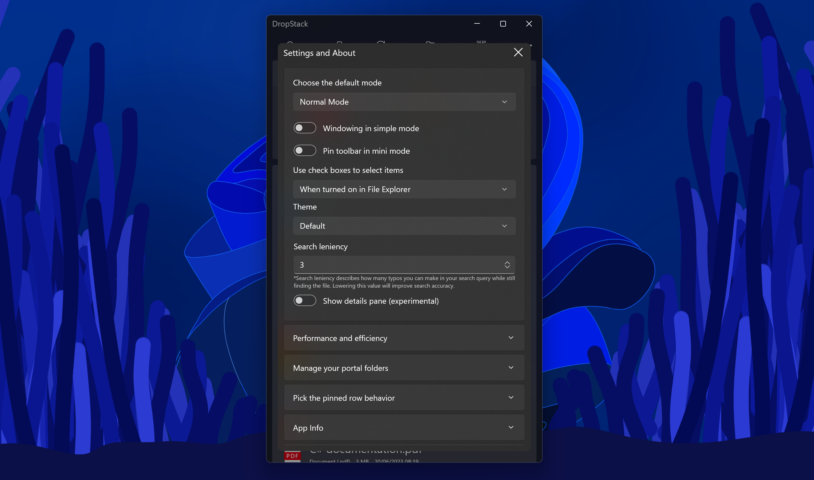

# DropStack
Playing hide-and-seek with your files was never an option!

## DropStack's Mission
DropStack's main goal is to help you reach the most recently added or modified file in your downloads folder or any other folders that you need quick access to. In addition to this, DropStack also offers a feature that allows you to pin any files you like to quickly access them later.

##  Getting Started
On first launch, DropStack will greet you and allow you to pick two unique locations. The first one will be used for its Portal feature, which works similarly to macOS's dock stacks, and the second one will be used to store your pinned files.

Remember that DropStack copies your pinned files to this location, meaning that you can move or even delete the original without it disappearing from your DropStack pinned library.

Before exiting the setup, you may also chose to set [simple mode](https://github.com/Blindside-Studios/DropStack?tab=readme-ov-file#simple-mode) as the default mode if you like.

And that's it, you're done with the setup!

## Navigation
### General Structure
DropStack unifies your portal files and your pinned files into one view.
At the top, you can find your pinned files in the expander. You can click the header to expand or collapse your pinned files. To add files, just drag them into this section. To remove then, simply click the unpin icon and confirm their removal.

### File Interactions
Once you located the file(s) of your desire, you have three main ways of interacting with it:
- You can drag them out into any application you wish - or the pinned files area.
- Alternatively, you can double-click or double-tap a file  to open it in its default program.
- You may also single-tap a file, which will select it and show a small flyout or right-click it to show an expanded version of this menu to give you even more options.

You can even select multiple files at once and then take action on them by holding the Control or Shift Keys while selecting.

Note that this applies to all files throughout the application and its [different views](https://github.com/Blindside-Studios/DropStack/main/README.md#views).

### Navigation Bar
At the top of the window, you will find multiple buttons. These are:

| Action   | Description   | Shortcut   |
| ---            |     ---          |          ---   |
| Search     | This lets you search through all of your files. Search is not case sensitive, so you do not need to remember your own or that website's spelling conventions.       | Ctrl+F      |
| Copy       | This button coppies the last selected file - if no file was selected, it will just copy the newest one.         | Ctrl+C        |
| Refresh       | DropStack will do its best to keep its list up-to-date, however, that may not always work out as planned - so, this is a way to fix that.         | Ctrl+R        |
| Reveal...     | This button will give you a list of folders you associated with DropStack so you can view them in File Explorer.       | Ctrl+E      |
| Select       | This button toggles little checkboxes next to your files so you can select multiple of them even if you don't have a keyboard.         | Ctrl+Q        |
| Simple     | This launches [Simple Mode](https://github.com/Blindside-Studios/DropStack/main/README.md#simple-mode)       | Ctrl+S      |
| Mini       | This launches [Mini Mode](https://github.com/Blindside-Studios/DropStack/main/README.md#mini-mode)         | Ctrl+M        |
| Copy newest     | This copies the most recently modified file in your portal folder even if a file has been selected.       | Ctrl+X      |
| Open       | This opens the last selected file.         | Ctrl+A        |
| Settings & About     | Houses various [customization options](https://github.com/Blindside-Studios/DropStack/main/README.md#customization) and information about the app, such as its current version and our [privacy statement](https://github.com/Blindside-Studios/DropStack/main/README.md#privacy-statement).       | Ctrl+I      |

The wider your window is, the more buttons will be shown at the top of the app. However, we still recommend keeping the window as narrow as possible, since DropStack has been designed around a vertical layout

# Views
## Simple Mode

In simple mode, buttons that cluttered up the interface have been reduced to a minimum, to the point where the top row just shows the folder name of either the primary portal folder or the pinned folder you choose at setup, as well as two buttons, one to launch the full DropStack experience, and another one to dismiss the flyout-like experience.

In the row below, you will find eight filter options. @ItsEeleeya proposed this idea in the form of a mockup, and we agreed - adding a search bar to simple mode wouldn't fit its philosophy of being simple and intuitive. Instead, we added a row of filter options. Currently, these consist of All, Pinned, Documents, Pictures, Music, Videos, Applications and Presentations.

Below this row, you can find the familiar file experience with a few design refinements to fit Simple Mode's vibes better, such as reduced opacities and pill shapes - to keep things simple, we also removed file extensions from the file names and show them inside the pills.

By default, this experience has light dismiss-enabled, meaning that tapping outside of it or switching to another window will close it - if you do not like this experience, you may enable proper windowing for Simple Mode in settings.

## Mini Mode

Mini mode used to be a part of DropStack since day one, previously running under the name of Simple Mode. After it was replaced by the previously mentioned Simple Mode, people have expressed their wish to get old Simple Mode back - so we brought it back as Mini Mode with many refinements. It can now show more than just one file at a time due to layout improvements and the toolbar that is hidden behind the pill (it can also be pinned through settings) now is more powerful than ever.

Mini Mode will also stay ontop of other applications so you can bring your files with you wherever you go.

## Customization

Settings allows you to tweak DropStack's behavior. To elevate the discoverability and reducing complexity, each toggle is ToolTip-enabled, meaning that hovering your mouse cursor over a toggle gives a short explanation of what is about to change after clicking the toggle. So whether you are just changing the theme or tweak the search algorithm, you can always be sure of what you're doing.

Here are some of the settings that are currently available:
- **Default mode**: Pick whether the app launches into Normal Mode, Simple Mode or Mini Mode when you open it.
- **Theme**: DropStack lets you customize the background with six themes, plus the default theme with a Mica backdrop, plus a hidden theme you might find while clicking around in the app.
- **Performance and efficiency**: This gives you control about how DropStack loads in files, including how many files and thumbnails are loaded, down to details like the thumbnail resolution.
- **Manage your portal folders**: This lets you add, modify and toggle secondary portal folders to be displayed in your portal files, both in normal and in simple mode. THis is also where you can reset the app and go through the onboarding flow again.
- **Pick the pinned row behavior**: Clicking on this expander will give you four options to choose between, regarding the top row with pinned files:
    - **Always opened**: This will always start DropStack with the pinned row being expanded. This is the default setting
    - **Remember last state**: This will automatically expand the pinned row if it was expanded when you last closed the app.
    - **Always close**: This will always launch DropStack with the bar being collapsed.
    - **Protect through Windows Hello™️**: This will protect your pinned files and only let you see them after you confirmed it is you via facial recognition, scanning your fingerprint, entering your pin or any other way that is supported by Windows Hello. This is entirely handled by Windows so DropStack never gets to see any of these features. To learn mode, please refer to the [privacy statement](https://github.com/Blindside-Studios/DropStack/main/README.md#privacy-statement) below.
    - **Hide pin bar**: In case you don't use pinned files, you may also hide pinned files altogether.

## Privacy Statement
### Local Abilities
DropStack will only ever access the folder paths that you specifically choose with the folder picker. 
DropStack will also only see top-level files, meaning that anything that is inside a folder or a compressed file cannot be seen by the app. 
DropStack never shares any information about your files with anyone, including first- and third-party software, as well as the developer.
In fact, DropStack's capability to access the internet has been fully disabled.

### About Windows Hello™️
Authenticating with Windows Hello means that only Windows ever gets to see your biometric details, PIN or hardware key. 
There is no point in time where the app is able to see your login credentials or authentication details.

## Update Policy
We plan to frequently update DropStack with new features and bug fixes, however, we do not provide any legal binding that entitles you to updates.

## Feedback
If you would like to provide feedback, feel free to do so. We are always happy to listen to your feature suggestions and other things you would like to see changed. If you want to report a bug or suggest a feature, please issue a GitHub ticket. We also plan to add an integrated feedback system into the app down the line.
