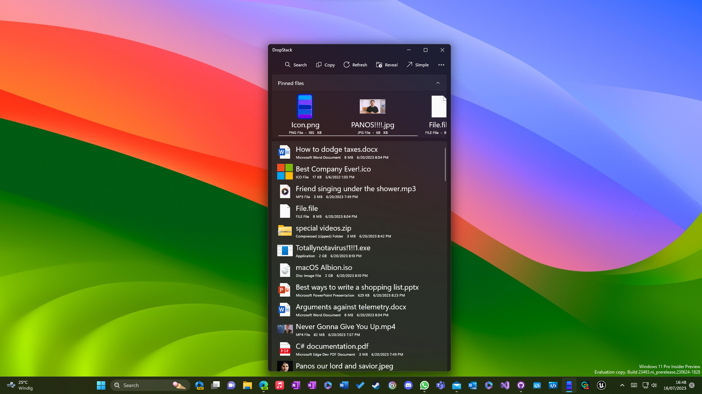
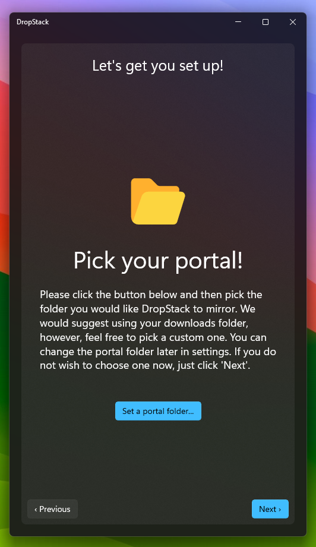
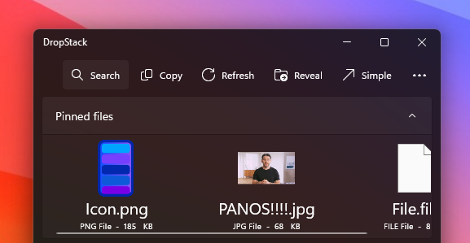
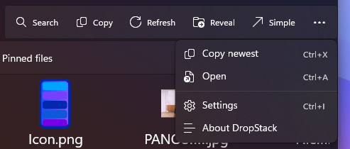
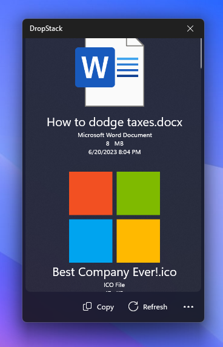
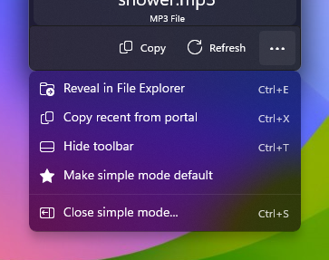
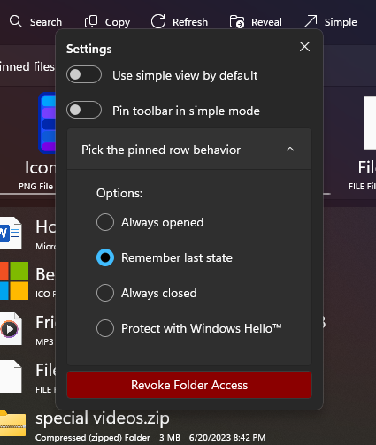

# DropStack
An emulation of the dock stacks feature from MacOS, built with the UWP framework

## DropStack's basics
DropStack's main goal is to help you reach the most recently added or modified file in your downloads folder or any folder that you choose. In addition to this, DropStack also offers a feature that allows you to pin any files you like, in order to quickly access them later on.

## DropStack's audience
We know that opening File Explorer, choosing the downloads folder and then finding the file you are looking for is and will always be a valid way to access your files. However, for some users, especially those that use their device with a touch screen, this might be very cumbersome. DropStack offers a simpler and more comfortable way to access these files.

## How it works
### Getting started
On first launch, DropStack will greet you and allow you to pick two unique locations. The first one will be used for its Portal feature, which works similarly to macOS' dock stacks, and the second one will be used to store your pinned files.

Remember that DropStack copies your pinned files to this location, meaning that you can move or even delete the original without it disappearing from your DropStack pinned library.

And that's it, you're done with the setup!

### Navigation
DropStack unifies your portal files and your pinned files into one view.
At the top, you can find your pinned files in the expander. You can click the header to expand or collapseyour pinned files. To add files, just drag them into this section. To delete them, drag them out of these section into the recycle bin on your desktop.

### File Interactions
Once you located the file of your desire, you have three main ways of interacting with it:
- Double-Click: Double-clicking on the file's name will open the file.
- Right-Click: Right-clicking (or long-pressing) on the file will copy the file to your clipboard, indicated through a small flyout, which appears on the bottom side of the app.
- Drag: Next to opening and copying the file, DropStack also allows you to drag your file anywhere - this means you can drop the file into another app or your folder or even your desktop. If you are using a touch screen, you can long-press the file and then drag it out.

This applies to all files in DropStack.

### Navigation Bar
At the top of the window, you will find multiple buttons. These are:
- Search: This lets you search through all of your files. Search is not case sensitive, so you do not need to remember your own or that website's spelling conventions.
- Copy: This button allows you to single-Click a file and then copy it to the clipboard - this is mainly meant for tablet and laptop users who do not have a proper right mouse button.
- Refresh: You updated a file but the update doesn't show? Just click this button.
- Reveal: This reveals the portal folder inside of File Explorer in case you need to take more advanced actions with your files.
- Simple: This launched simple mode (more on simple mode later).
- Copy newest: This copies the most recently modified file in your portal folder.
- Open: This opens the last selected file and is intended for people who have difficulties with the fast action of double-clicking or double-tapping. DropStack's mission is to make it easier to get to your files, for everyone.
- Meatball Menu: The meatball menu houses all the items that did not fit on the top bar of the window, plus settings and the about DropStack section, which includes general app info and a [privacy statement](https://github.com/Blindside-Studios/DropStack/main/README.md#privacy-statement), explaining our no-telemetry policy.

The wider your window is, the more buttons will be shown at the top of the app. However, we still recommend to keep the window as narrow as possible.

Note that all of these commands can be executed via keyboard shortcuts. Here is the current list of keyboard shortcuts:
- Ctrl+F: Search
- Ctrl+C: Copy last selected
- Ctrl+R: Refresh
- Ctrl+E: Reveal in File Explorer
- Ctrl+S: Launch simple mode
- Ctrl+X: Copy newest from portal
- Ctrl+A: Open last selected
- Ctrl+I: Settings
 
We put great emphasis on choosing the keyboard shortcuts with the perfect balance of making sense and beaing neatly organized around your left hand and in close proximity to the left control key.

### Simple mode
Simple mode displays less items with larger icons, which is perfect if you are using a tablet or don't want to be overwhelmed by a large list of files. The whole experience has been simplified to represent the core of DropStack's identity.

 

Simple mode by default hides the toolbar and lets you focus entirely on your files. In case you do want to take an aciton with a file, though, simple mode has got you covered. Just hover over or tap the pill at the bottom and simple mode will present you with the options to copy the recent file and to refresh the list. These are the two commands we felt were most essntial to the experience. In case you want more control, the familiar meatballmenu is of course still there.

And of course, as long as a feature is shared between normal mode and simple mode, the keyboard shortcut is the same. We also added a new one:
- Ctrl+T: This shortcut temporarily hides the toolbar in case you set it to be always visible.

### Settings
Settings allows you to tweak DropStack's behavior. To elevate the discoverability and reducing complexity, each toggle is ToolTip-enabled, meaning that holding your mouse cursor over a toggle gives a short explanation of what is about to change, after clicking the toggle.

Here are the settings that are currently available:
- Use simple view by default: Allows you to toggle between complex and simple view. This will reflect in the page that is being disaplayed in the background instantly.
- Pin toolbar in simple mode: If you would like for the above mentioned toolbar in simple mode to be persistently displayed, toggle this setting.
- Pick the pinned row behavior: Clicking on this expander will give you four options to choose between, regarding the top row with pinned files. More on these later.
- Revoke Folder Access: Lets you disconnect the app from the folder you are currently viewing, whether it is the portal folder or the pinned folder. This requires a confirmation. Disconnecting either folder will restart the app, disconnecting both will guide you through the initial setup again. Note that none of your files are being lost, they are just not accessible in your app anymore. This is helpful in the case that you would like to pick another folder.

Here are the four settings regarding the pinned row:
- Always opened: This will always start DropStack with the pinned row being expanded. This is the default setting
- Remember last state: This will automatically expand the pinned row if it was expanded when you last closed the app.
- Always close: This will always launch DropStack with the bar being collapsed.
- Protect through Windows Hello™️: This will protect your pinned files and only let you see them after you confirmed it is you via facial recognition, scanning your fingerprint, entering your pin or any other way that is supported by Windows Hello. This is entirely handled by Windows so DropStack never gets to see any of these features. To learn mode, please refer to the [privacy statement](https://github.com/Blindside-Studios/DropStack/main/README.md#privacy-statement) below.

## Privacy statement
### Local abilities
DropStack will only ever access the folder paths that you specifically choose with the folder picker. 
DropStack will also only see top-level files, meaning that anything that is inside a folder or a compressed file cannot be seen by the app. 
DropStack never shares any information about your files with anyone, including first- and third-party software, as well as the developer.
In fact, DropStack's capability to access the internet has been fully disabled.

### About Windows Hello™️
Authenticating with Windows Hello means that only Windows ever gets to see your biometric details, PIN or hardware key. 
There is no point in time where the app is able to see your login credentials or authentication details.

## Update policy
We plan to frequently update DropStack with new features and bug fixes, however, we do not provide any legal binding that entitles you to updates.

## Feedback
If you would like to provide feedback, feel free to do so. We are always happy to listen to your feature suggestions and other things you would like to see changed. If you want to report a bug or suggest a feature, please issue a GitHub ticket. We also plan to add an integrated feedback system into the app down the line.
